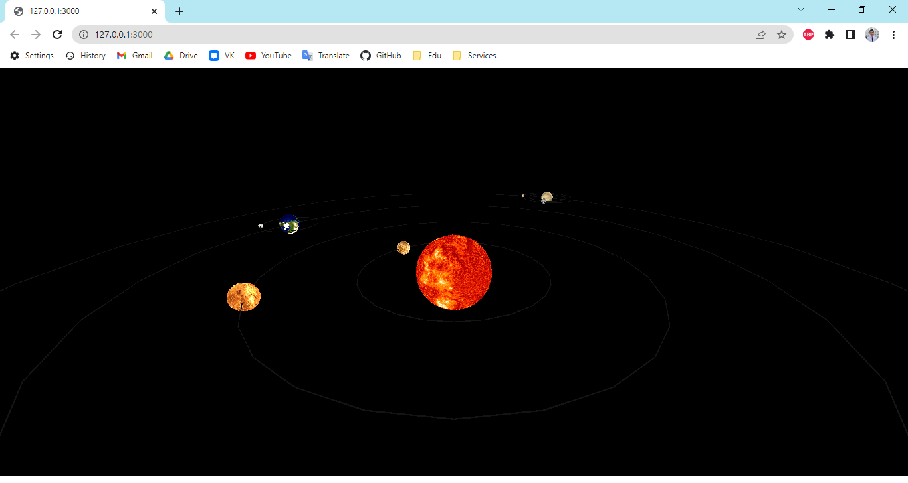

# Solar System Visualisation
___

## Start
1. Load repository.
```
> git clone git@github.com:ArturAlimgafarov/SolarSystem.git
```
2. Run server.
Example (_NodeJS_):
``` javascript
> npm install -g http-server
> http-server -c-1 -p 3000 --cors
```
3. Go to _http://127.0.0.1:3000_.

### Visualisation:

